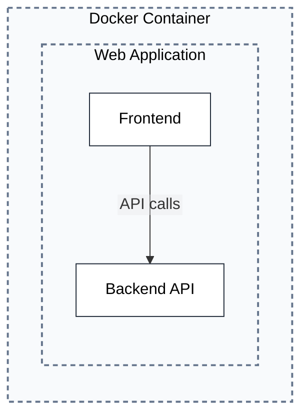

```mermaid
%%{init: {"flowchart": {"htmlLabels": false}}}%%
flowchart TB
classDef boundary fill:#f8fafc,stroke:#64748b,stroke-dasharray: 5 4,stroke-width:2px,color:#000;
classDef node fill:#ffffff,stroke:#1f2937,stroke-width:1px,color:#000;
classDef iface fill:#f1f5f9,stroke:#64748b,stroke-width:1px,font-size:10px,color:#000;
classDef highlight fill:#fef3c7,stroke:#f59e0b,stroke-width:2px,color:#000;

        subgraph docker-container["Docker Container"]
        direction TB
                subgraph web-app["Web Application"]
                direction TB
                    backend["Backend API"]:::node
                    frontend["Frontend"]:::node
                end
                class web-app boundary
        end
        class docker-container boundary


    frontend -->|API calls| backend


```