# Block Architecture — Navigation Example (Permutation Test)

This page demonstrates **Mermaid diagrams with clickable nodes** and many permutations.
⚠️ Note: GitHub issue rendering ignores `click`, but if you copy/paste into a `.mmd` file or a markdown site with Mermaid enabled, clicking works.

---

## 0) Baseline (Flat, neighbors, with interfaces)

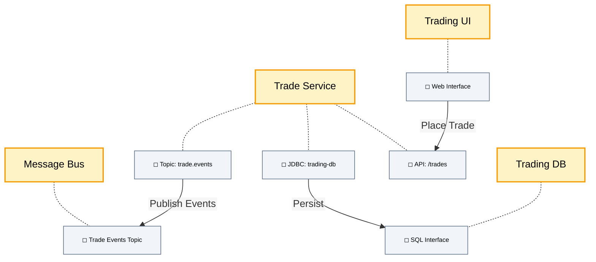

---

## 1) Flat, neighbors, **no** interfaces

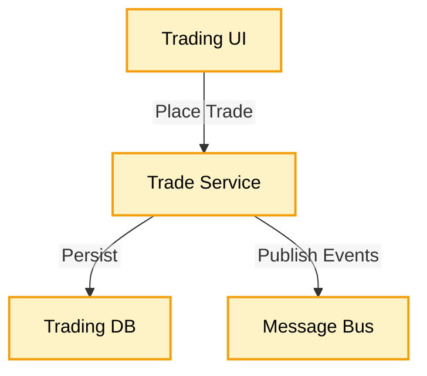

---

## 2) Immediate container context (parents), neighbors, with interfaces

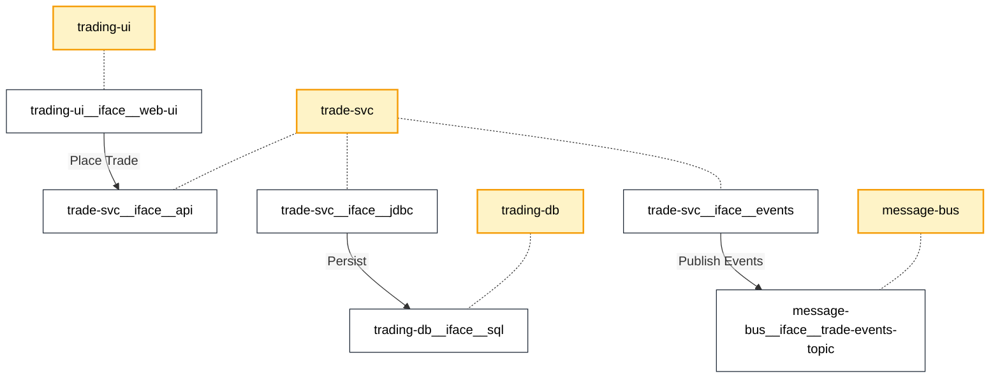

---

## 3) Parents, neighbors, **no interfaces** (cleaner context)

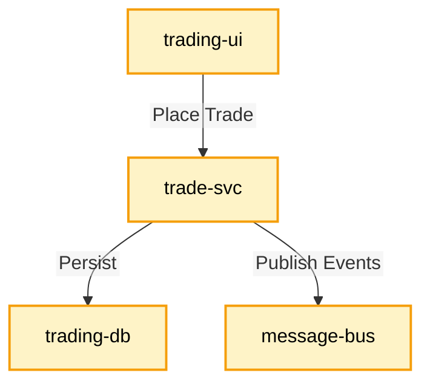

---

## 4) All containers (ecosystem shells), neighbors, with interfaces

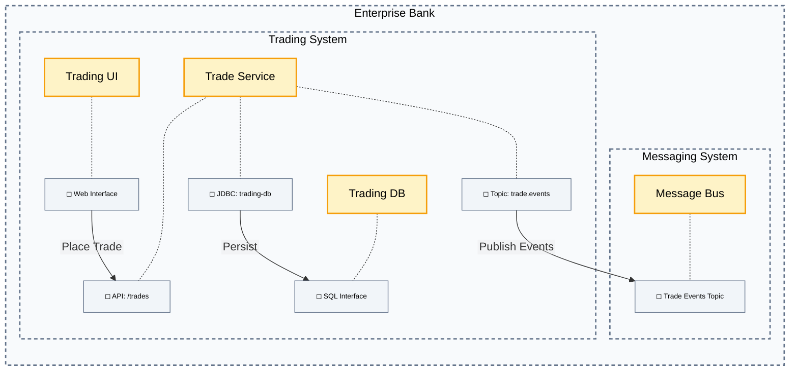

---

## 5) All containers (ecosystem shells), neighbors, **no interfaces**

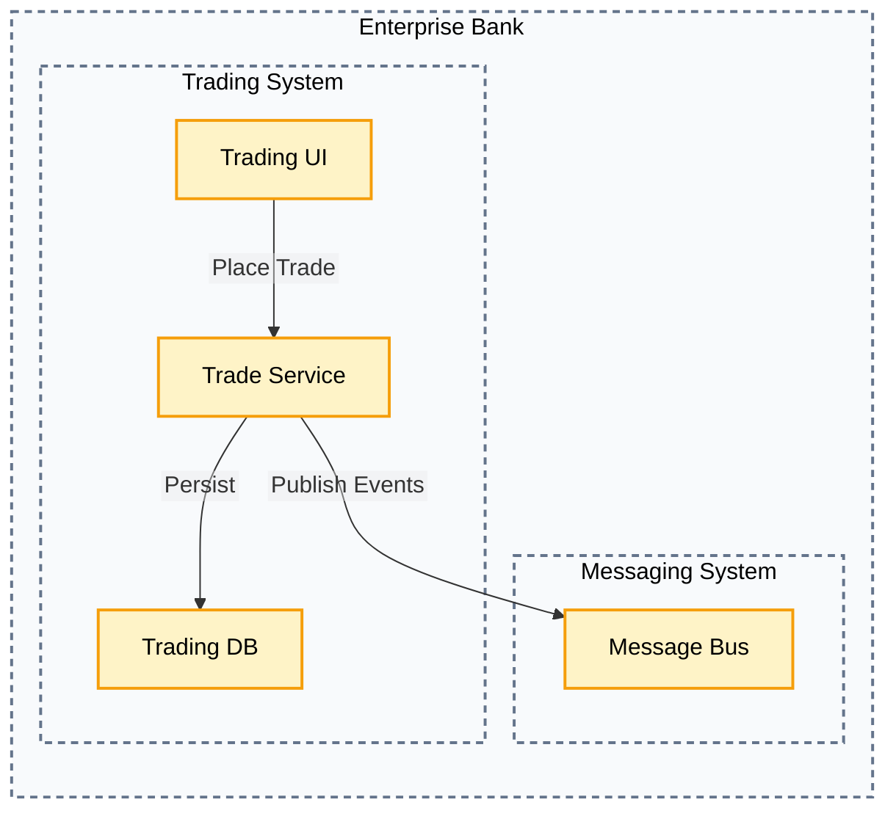

---

## 7) System slice (explicit): focus trading-system, children + neighbors

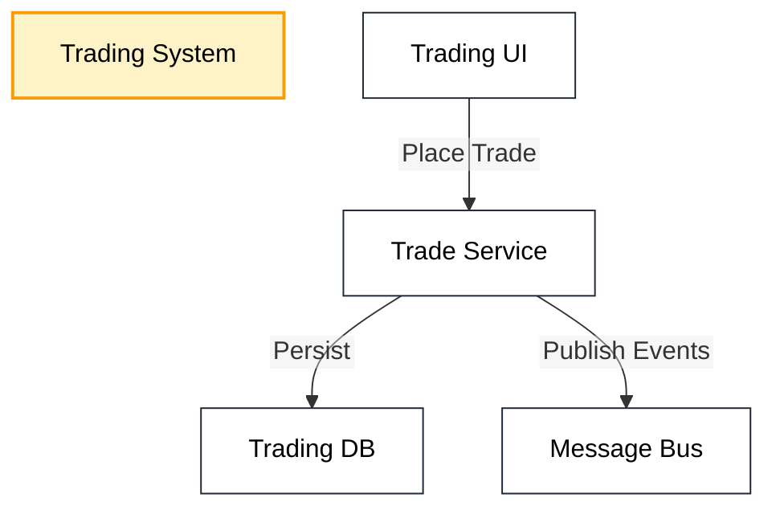

> **Explicit system view**: `include-containers="none"`, `include-children="all"`, `edges="connected"`.

---

## 8) Details slice (explicit): focus trade-svc, interfaces + neighbors

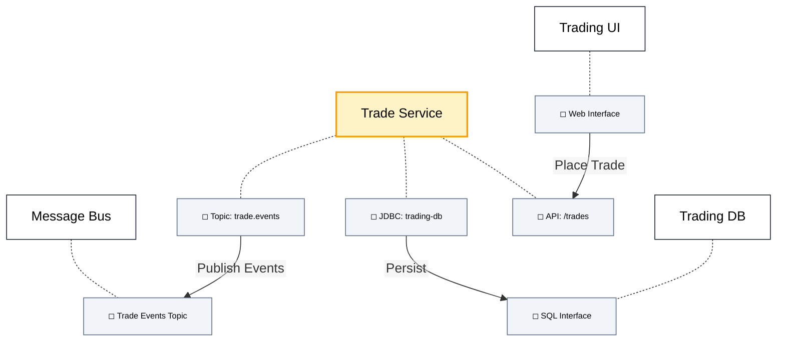

> **Explicit details view**: flat + interfaces + neighbors.

---

## 9) Focus on **UI** only, flat, neighbors, interfaces off (just to vary)

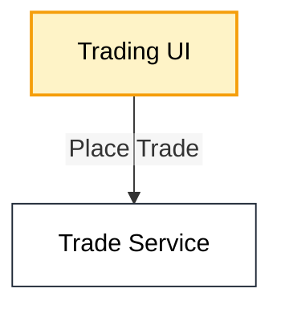

---

## 10) Focus on **DB** only, parents containers, neighbors, with interfaces

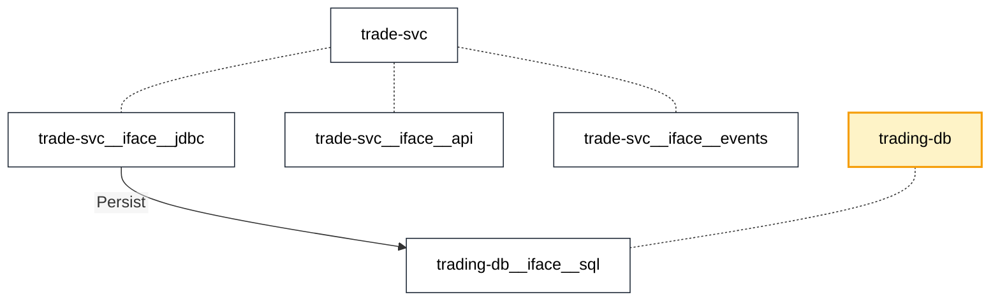

---

## 11) Flat slice with **edges off** (structure with attachments only)

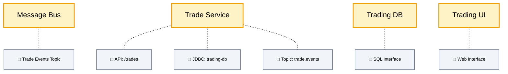

---

# Details (Anchor Targets)

## Trading System
Some notes about the **Trading System**.

## Position System
Some notes about the **Position System**.

## Messaging System
Some notes about the **Messaging System**.

## Trading UI
Details about **Trading UI**.

## Trade Service
Details about **Trade Service**.

### Trade Service API
Details about the **API interface**.

### Trade Service Storage
Details about the **storage interface**.

### Trade Service Events
Details about the **events interface**.

## Trading DB
Details about **Trading DB**.

## Message Bus
Details about **Message Bus**.