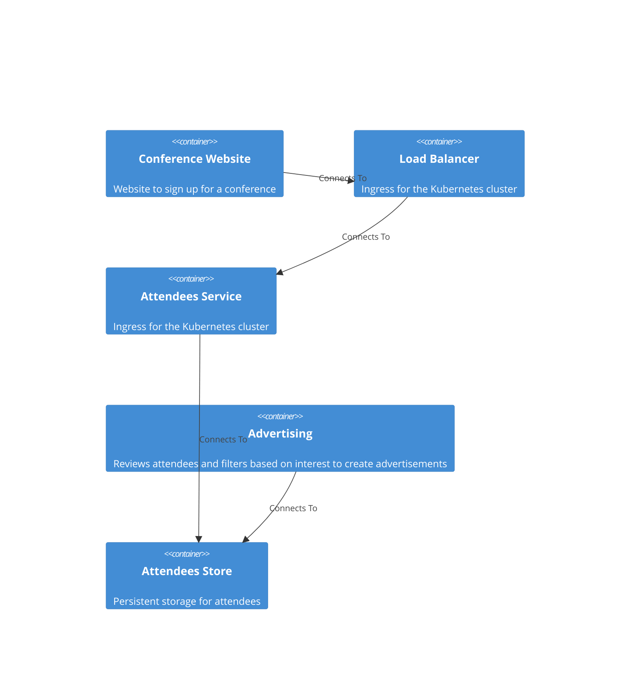

# Welcome to CALM Documentation

This documentation is generated from the **CALM Architecture-as-Code** model.

## High Level Architecture

### Nodes
    - [Conference Website](nodes/conference-website)
    - [Load Balancer](nodes/load-balancer)
    - [Attendees Service](nodes/attendees-service)
    - [Advertising](nodes/advertising)
    - [Attendees Store](nodes/attendees-store)

### Flows

### Controls

| ID    | Name             | Description                  | Domain    | Scope        | Applied To                |
|-------|------------------|------------------------------|-----------|--------------|---------------------------|
