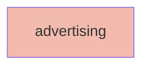

## Node Details

| Field               | Value                    |
|---------------------|--------------------------|
| **Unique ID**       | advertising                   |
| **Node Type**       | service             |
| **Name**            | Advertising                 |
| **Description**     | Reviews attendees and filters based on interest to create advertisements          |
| **Data Classification** |  |
| **Run As**          |                 |

## Interfaces
    _No interfaces defined._

## Related Nodes

## Controls

    _No controls defined._
