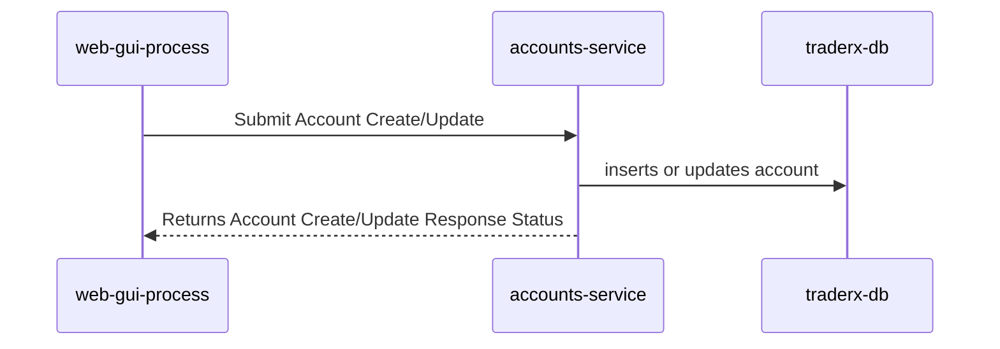
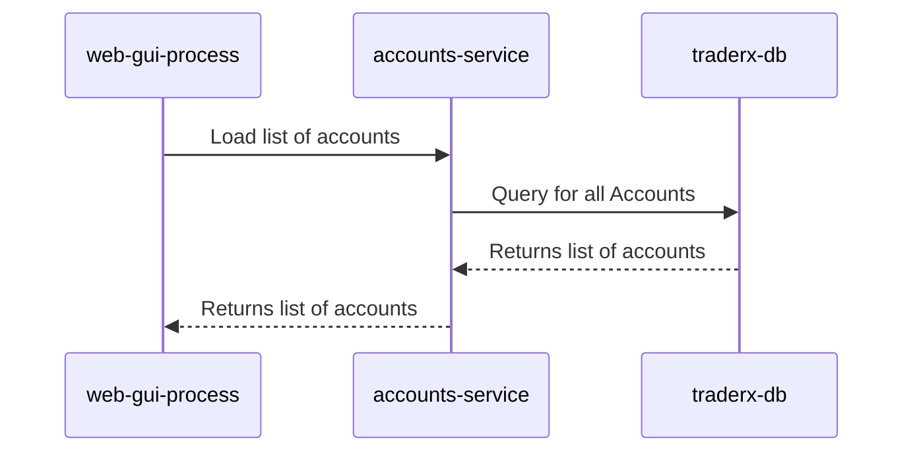
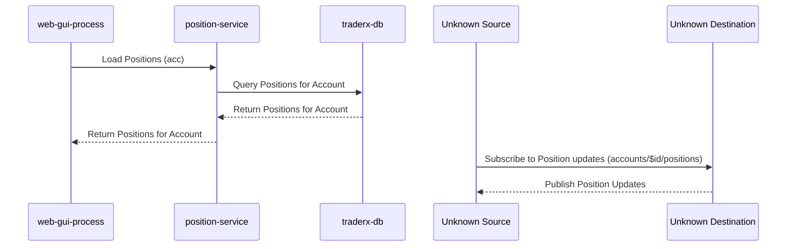
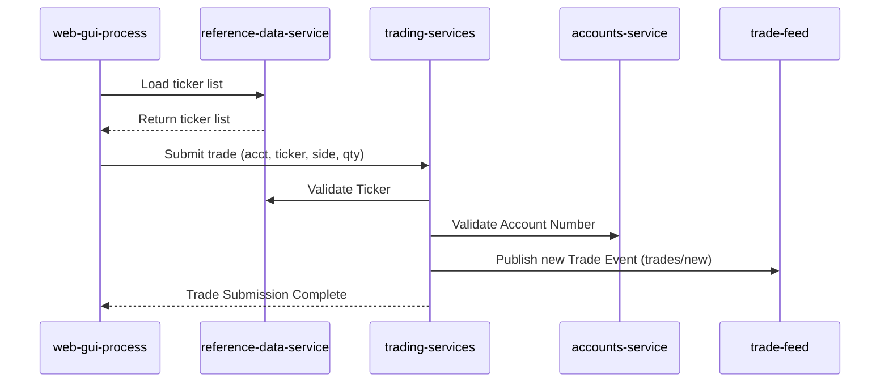
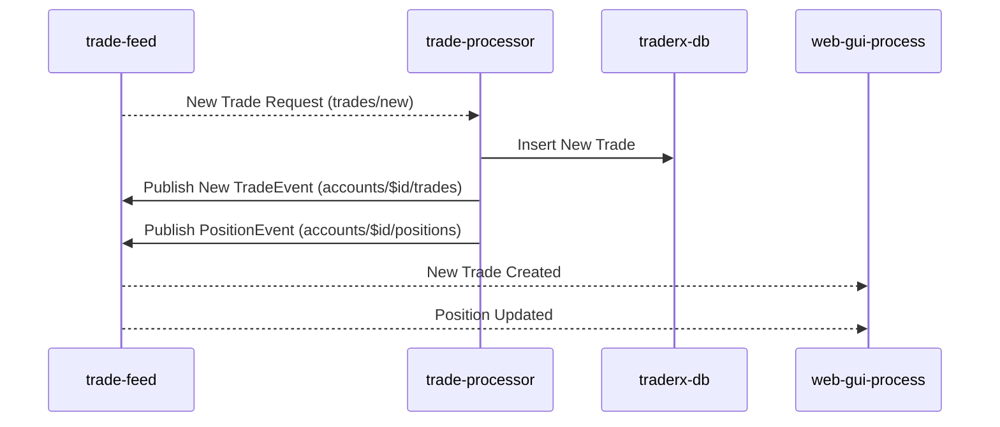
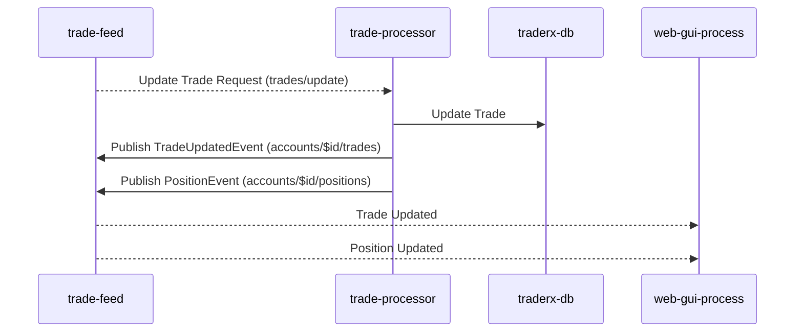

## Add or Update Account

Flow for adding or updating account information in the database.

## Load List of Accounts

Flow for loading a list of accounts from the database to populate the GUI drop-down for user account selection.

## Load Positions

Flow for loading positions for a specific account and subscribing to updates.

## Submitting a Trade Ticket

Flow for submitting a trade ticket and validating the trade, account, and publishing a new trade event.

## Trade Processing - New Trade

The process flow for handling new trade events

## Trade Processing - Update Trade

The process flow for handling update trade events

