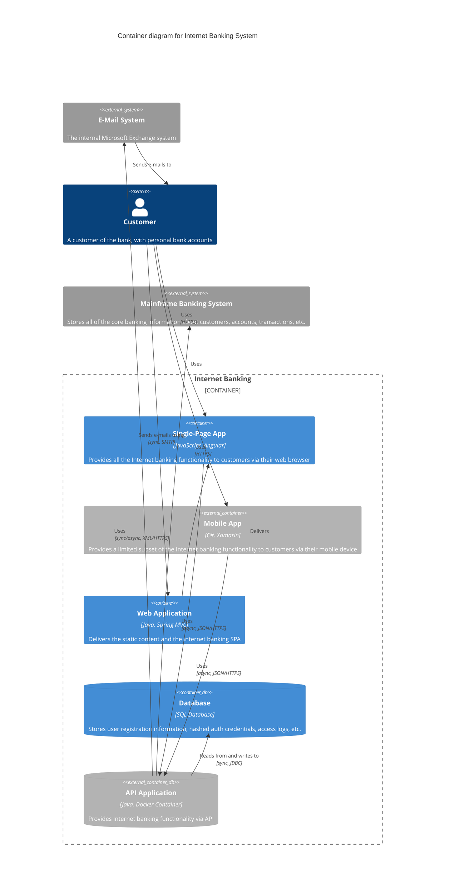
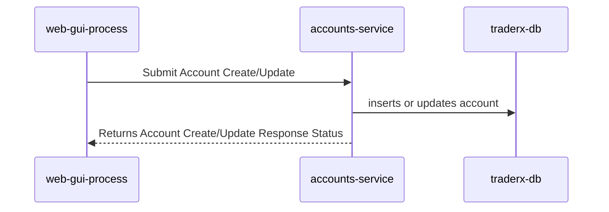
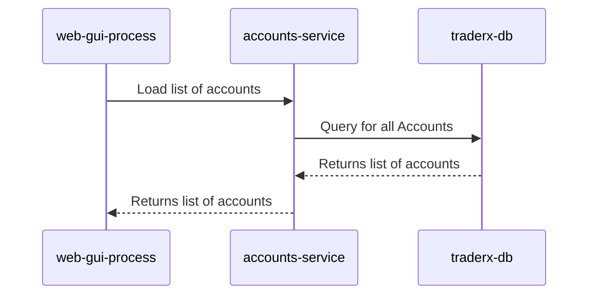
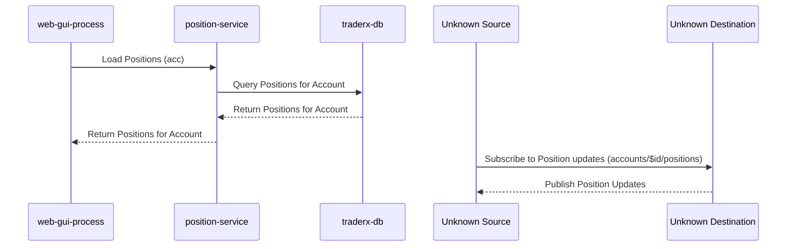
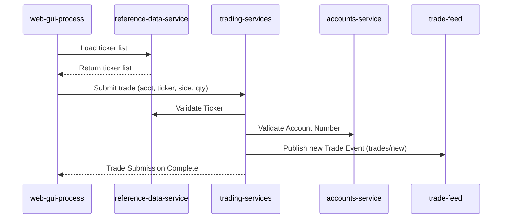
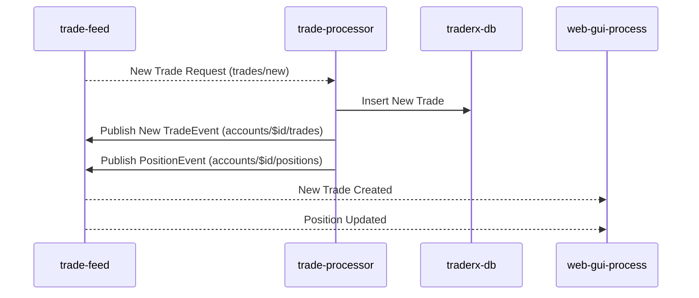
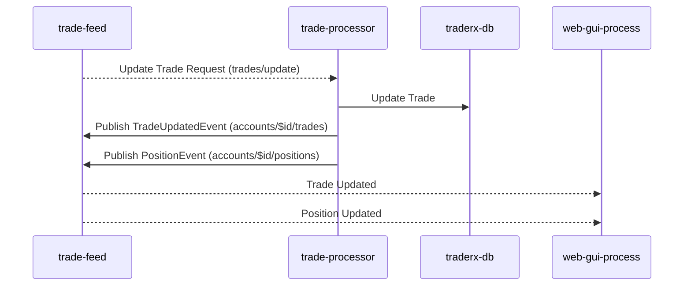

# TraderX
TraderX CALM Architecture

## Architecture

## Flows
### Add or Update Account

Flow for adding or updating account information in the database.

### Load List of Accounts

Flow for loading a list of accounts from the database to populate the GUI drop-down for user account selection.

### Load Positions

Flow for loading positions for a specific account and subscribing to updates.

### Submitting a Trade Ticket

Flow for submitting a trade ticket and validating the trade, account, and publishing a new trade event.

### Trade Processing - New Trade

The process flow for handling new trade events

### Trade Processing - Update Trade

The process flow for handling update trade events

## Nodes
| Name      | Node Type | Description | Data Classification | Run As | Instance |
|-----------|-----------|-------------|---------------------|--------|----------|
| TraderX  | system | Simple Trading System |  |  |  |
| Trader  | actor | Person who manages accounts and executes trades |  |  |  |
| Web Client  | webclient | Browser based web interface for TraderX | Confidential | user |  |
| Web GUI  | service | Allows employees to manage accounts and book trades | Confidential | systemId |  |
| Position Service  | service | Server process which processes trading activity and updates positions | Confidential | systemId |  |
| TraderX DB  | database | Database which stores account, trade and position state | Confidential | systemId |  |
| Bank ABC Internal Network  | network | Internal network for Bank ABC |  |  | Internal Network |
| Reference Data Service  | service | Service which provides reference data | Confidential | systemId |  |
| Trading Services  | service | Service which provides trading services | Confidential | systemId |  |
| Trade Feed  | service | Message bus for streaming updates to trades and positions | Confidential | systemId |  |
| Trade Processor  | service | Process incoming trade requests, settle and persist | Confidential | systemId |  |
| Accounts Service  | service | Service which provides account management | Confidential | systemId |  |
| People Service  | service | Service which provides user details management | Confidential | systemId |  |
| User Directory  | ldap | Golden source of user data | PII | systemId |  |

## Relationships
| Name      | Node Type | Description | Data Classification | Run As | Instance |
|-----------|-----------|-------------|---------------------|--------|----------|
| TraderX  | system | Simple Trading System |  |  |  |
| Trader  | actor | Person who manages accounts and executes trades |  |  |  |
| Web Client  | webclient | Browser based web interface for TraderX | Confidential | user |  |
| Web GUI  | service | Allows employees to manage accounts and book trades | Confidential | systemId |  |
| Position Service  | service | Server process which processes trading activity and updates positions | Confidential | systemId |  |
| TraderX DB  | database | Database which stores account, trade and position state | Confidential | systemId |  |
| Bank ABC Internal Network  | network | Internal network for Bank ABC |  |  | Internal Network |
| Reference Data Service  | service | Service which provides reference data | Confidential | systemId |  |
| Trading Services  | service | Service which provides trading services | Confidential | systemId |  |
| Trade Feed  | service | Message bus for streaming updates to trades and positions | Confidential | systemId |  |
| Trade Processor  | service | Process incoming trade requests, settle and persist | Confidential | systemId |  |
| Accounts Service  | service | Service which provides account management | Confidential | systemId |  |
| People Service  | service | Service which provides user details management | Confidential | systemId |  |
| User Directory  | ldap | Golden source of user data | PII | systemId |  |

