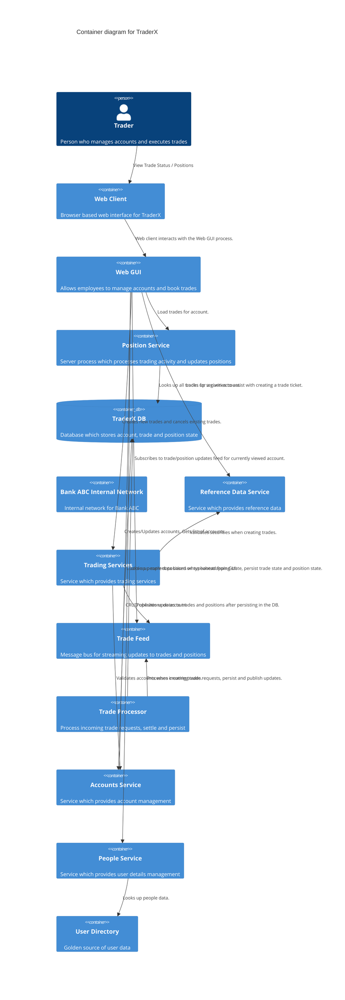
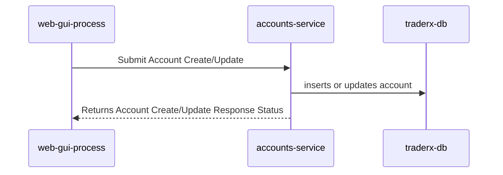
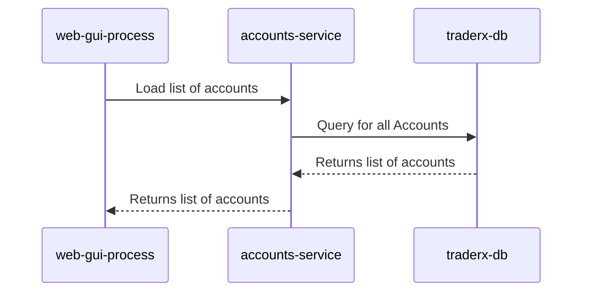
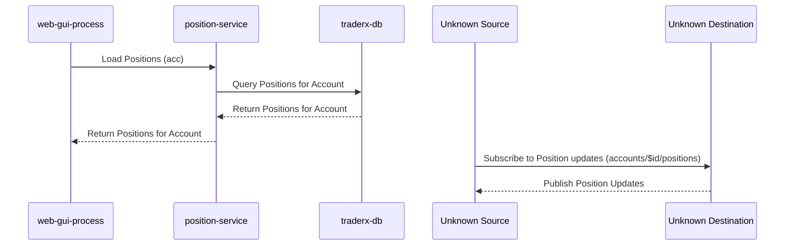
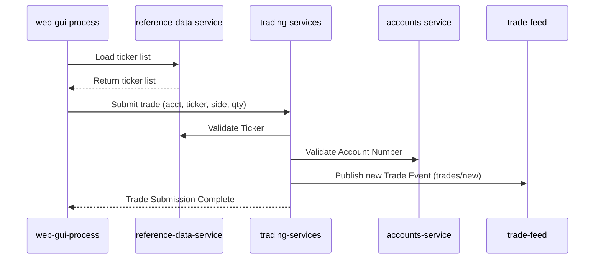
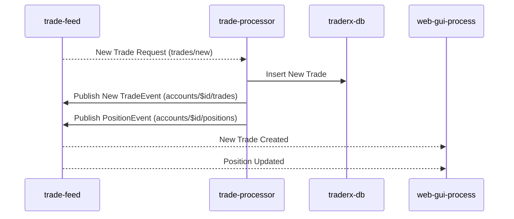
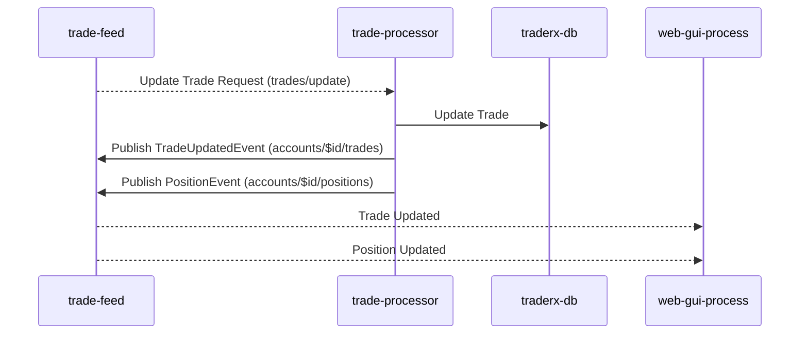

# TraderX
TraderX CALM Architecture

## Architecture

## Flows
### Add or Update Account

Flow for adding or updating account information in the database.

### Load List of Accounts

Flow for loading a list of accounts from the database to populate the GUI drop-down for user account selection.

### Load Positions

Flow for loading positions for a specific account and subscribing to updates.

### Submitting a Trade Ticket

Flow for submitting a trade ticket and validating the trade, account, and publishing a new trade event.

### Trade Processing - New Trade

The process flow for handling new trade events

### Trade Processing - Update Trade

The process flow for handling update trade events

## Nodes
| Name      | Node Type | Description | Data Classification | Run As | Instance |
|-----------|-----------|-------------|---------------------|--------|----------|
| TraderX  | system | Simple Trading System |  |  |  |
| Trader  | actor | Person who manages accounts and executes trades |  |  |  |
| Web Client  | webclient | Browser based web interface for TraderX | Confidential | user |  |
| Web GUI  | service | Allows employees to manage accounts and book trades | Confidential | systemId |  |
| Position Service  | service | Server process which processes trading activity and updates positions | Confidential | systemId |  |
| TraderX DB  | database | Database which stores account, trade and position state | Confidential | systemId |  |
| Bank ABC Internal Network  | network | Internal network for Bank ABC |  |  | Internal Network |
| Reference Data Service  | service | Service which provides reference data | Confidential | systemId |  |
| Trading Services  | service | Service which provides trading services | Confidential | systemId |  |
| Trade Feed  | service | Message bus for streaming updates to trades and positions | Confidential | systemId |  |
| Trade Processor  | service | Process incoming trade requests, settle and persist | Confidential | systemId |  |
| Accounts Service  | service | Service which provides account management | Confidential | systemId |  |
| People Service  | service | Service which provides user details management | Confidential | systemId |  |
| User Directory  | ldap | Golden source of user data | PII | systemId |  |

## Relationships
### Interacts Relationship

| Unique Id | Description | Actor    | Nodes                |
| ----------|----------|----------|----------------|
| trader-executes-trades | Executes Trades | traderx-trader | web-client |
| trader-manages-accounts | Manage Accounts | traderx-trader | web-client |
| trader-views-trade-status | View Trade Status / Positions | traderx-trader | web-client |

### Connect Relationships

|Unique Id | Description | Source    | Destination                |
| ----------|----------|----------|----------------|
| web-client-uses-web-gui | Web client interacts with the Web GUI process. | web-client | web-gui-process |
| web-gui-uses-position-service-for-position-queries | Load positions for account. | web-gui-process | position-service |
| web-gui-uses-position-service-for-trade-queries | Load trades for account. | web-gui-process | position-service |
| position-service-uses-traderx-db-for-positions | Looks up default positions for a given account. | position-service | traderx-db |
| position-service-uses-traderx-db-for-trades | Looks up all trades for a given account. | position-service | traderx-db |
| web-gui-process-uses-reference-data-service | Looks up securities to assist with creating a trade ticket. | web-gui-process | reference-data-service |
| web-gui-process-uses-trading-services | Creates new trades and cancels existing trades. | web-gui-process | trading-services |
| web-gui-process-uses-trade-feed | Subscribes to trade/position updates feed for currently viewed account. | web-gui-process | trade-feed |
| trade-processor-connects-to-trade-feed | Processes incoming trade requests, persist and publish updates. | trade-processor | trade-feed |
| trade-processor-connects-to-traderx-db | Looks up current positions when bootstrapping state, persist trade state and position state. | trade-processor | traderx-db |
| web-gui-process-uses-accounts-service | Creates/Updates accounts. Gets list of accounts. | web-gui-process | accounts-service |
| web-gui-process-uses-people-service | Looks up people data based on typeahead from GUI. | web-gui-process | people-service |
| people-service-connects-to-user-directory | Looks up people data. | people-service | user-directory |
| trading-services-connects-to-reference-data-service | Validates securities when creating trades. | trading-services | reference-data-service |
| trading-services-uses-trade-feed | Publishes updates to trades and positions after persisting in the DB. | trading-services | trade-feed |
| trading-services-uses-account-service | Validates accounts when creating trades. | trading-services | accounts-service |
| accounts-service-uses-traderx-db-for-accounts | CRUD operations on account | accounts-service | traderx-db |

