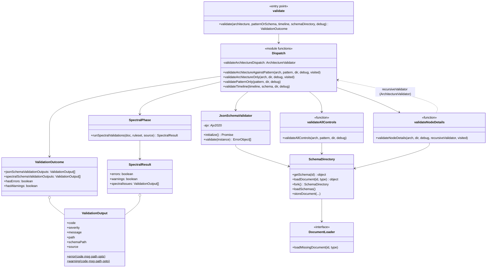
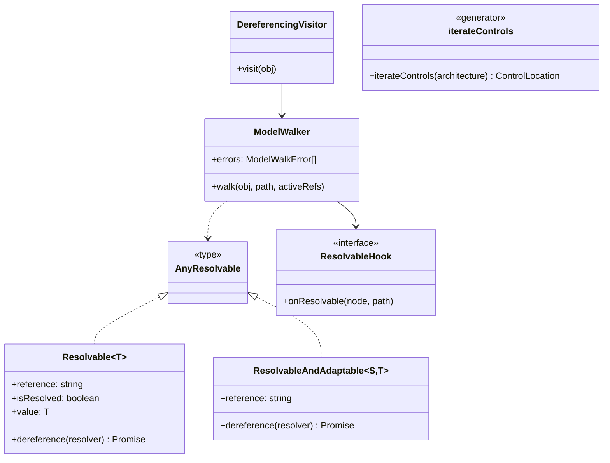
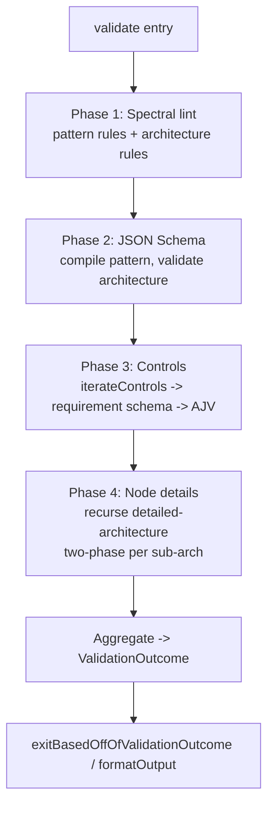
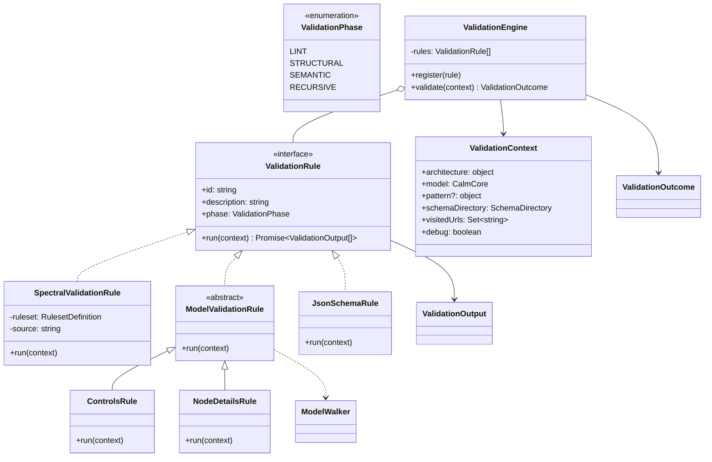
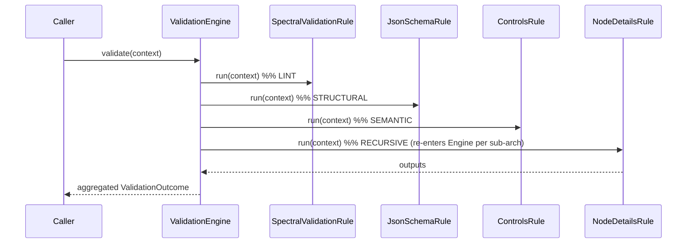

# Validation Design

Technical design for CALM document validation in `shared` (`@finos/calm-models` model +
`shared/src/commands/validate`). Covers the current architecture, the phased-validation model, and a
proposal for a first-class **ValidationRule** abstraction with two implementations (Spectral and
custom-on-model).

---

## 1. Objectives

- **O1 — One authoritative validator in `shared`.** Validation is a library concern, not a CLI
  concern. The CLI, CALM Hub (upload), CalmStudio, and any future tool call the same
  `validate(...)` entry point so guarantees cannot be bypassed by hitting an API directly.
- **O2 — Phased validation.** Run cheap/broad linting (Spectral) and structural schema validation
  (JSON Schema) as distinct phases, plus semantic/model checks (controls, node-details recursion).
  A failure in one phase still lets other phases report, so users get a complete picture.
- **O3 — Uniform, machine-readable output.** Every phase emits `ValidationOutput` items aggregated
  into a single `ValidationOutcome` with stable `code`, `severity`, JSON-pointer `path`, and
  `source`. Downstream (JUnit/JSON/pretty formatters, Hub UI) depends on this shape.
- **O4 — Cycle- and reference-safe traversal.** Detailed architectures and control configs are
  references that can form cycles; traversal must terminate and must not re-fetch or re-adapt more
  than necessary.
- **O5 — Extensibility.** Adding a new check should not require touching the orchestrator. Today it
  does (see §6).

## 2. Assumptions

- **A1 — Downstream expects the current `ValidationOutcome` contract.** `hasErrors`/`hasWarnings`
  drive process exit codes (`exitBasedOffOfValidationOutcome`); formatters read `jsonSchema*` and
  `spectral*` output arrays and each `ValidationOutput` field. Changing the *internals* of
  validation must **not** change this external contract.
- **A2 — `SchemaDirectory` is the single resolution boundary.** All remote/relative document and
  schema loading goes through `SchemaDirectory` (backed by a `DocumentLoader`). Validators never
  fetch directly.
- **A3 — The model owns references.** `Resolvable`/`ResolvableAndAdaptable` (calm-models) are the
  canonical representation of a `$ref`-like pointer. Raw documents are transient; only adapted model
  objects persist.
- **A4 — Spectral operates on raw JSON; model checks operate on the typed model.** Spectral rules
  use JSONPath (`given`/`then`) over the stringified document. Model checks (controls, node-details)
  operate on `CalmCore`. These are two different substrates today.
- **A5 — A pattern may be an explicit CALM pattern or the CALM core schema.** The orchestrator
  honours the architecture's `$schema` or an explicitly supplied pattern.
- **A6 — Validation is read-only and side-effect-free** apart from logging and cache population in
  `SchemaDirectory`.

## 3. Current architecture (as-built)

`validate(architecture?, patternOrSchema?, timeline?, schemaDirectory?, debug)` is the single entry
point. It dispatches by input combination to one of four flows, each returning a `ValidationOutcome`.

### Supporting model & traversal (calm-models + shared)

**Notes on the current design**
- Cycle safety lives in two places: `ModelWalker` (path-scoped `activeRefs`) for generic model
  traversal, and a threaded `visitedUrls: Set<string>` for the node-details recursion.
- `validateNodeDetails` recurses by calling back into the orchestrator via the injected
  `ArchitectureValidator` (avoids a circular import) and forks a cache-seeded `SchemaDirectory` per
  sub-architecture for AJV schema-id isolation.

## 4. Phased validation

For an architecture-against-pattern validation the phases are:

- **Phase 1 — Spectral (lint / semantic-on-JSON).** `runSpectralValidations` runs a `RulesetDefinition`
  (`rules-architecture`, `rules-pattern`, `rules-timeline`). Custom checks such as `idsAreUnique`,
  `nodeIdExists`, `interfaceIdExistsOnNode`, `sequenceNumbersAreUnique` are Spectral **custom
  functions** over JSONPath.
- **Phase 2 — JSON Schema (structural).** `JsonSchemaValidator` compiles the pattern/core schema with
  AJV (async schema loading via `SchemaDirectory`) and validates the architecture.
- **Phase 3 — Controls (semantic-on-model).** `validateAllControls` enumerates controls via
  `iterateControls`, resolves each requirement schema (URL or `#`-pointer into the pattern) and
  validates the control config against it with AJV.
- **Phase 4 — Node details (recursive).** `validateNodeDetails` loads each
  `details.detailed-architecture`, discovers its pattern (`required-pattern` or `$schema`) and
  re-enters phases 1–4 for the sub-architecture, cycle-guarded by the shared `visitedUrls` set.

Phases 3–4 only run when a `SchemaDirectory` is available; all phases contribute to the same
`ValidationOutcome` and OR their `hasErrors`/`hasWarnings` together.

## 5. The problem this exposes

The four phases are **not uniform**. Phases 1–2 are engine-driven (Spectral, AJV). Phases 3–4 are
hand-written traversals wired directly into the orchestrator. Two consequences:

1. **Two substrates for "custom" checks.** A semantic rule (e.g. "every node id is unique") is a
   Spectral function over JSON; a semantic rule like "control config satisfies its requirement" is
   bespoke TypeScript over the model. There is no common notion of "a validation rule".
2. **The orchestrator knows every check.** Adding a check means editing
   `validateArchitectureAgainstPattern`/`validateArchitectureOnly` (they already hand-inline the
   controls and node-details calls in both branches). This violates O5.

## 6. Proposal — a first-class `ValidationRule` abstraction

Introduce `ValidationRule` as the unit of validation, with a `ValidationContext` input and
`ValidationOutput[]` output, executed by a `ValidationEngine`. Provide **two implementations**:

- `SpectralValidationRule` — adapts a Spectral `RulesetDefinition` (raw-JSON / JSONPath rules).
- `ModelValidationRule` — a check over the **typed** `CalmCore` model, using `ModelWalker` for
  cycle-safe traversal. `validateAllControls` and `validateNodeDetails` become `ModelValidationRule`s.

**Execution flow with the engine**

### What this buys us
- **O5 extensibility:** new checks = new `ValidationRule` registered with the engine; the
  orchestrator stops growing.
- **Uniform semantics for "custom" checks:** a rule author chooses substrate — JSONPath
  (`SpectralValidationRule`) or typed model (`ModelValidationRule`) — but both produce
  `ValidationOutput[]` and are scheduled the same way.
- **Node-details recursion becomes ordinary:** `NodeDetailsRule.run` builds a child
  `ValidationContext` (forked `SchemaDirectory`, shared `visitedUrls`) and calls `engine.validate`
  again — the recursion the orchestrator hand-threads today.
- **Migration path for Spectral custom functions:** model-oriented checks (`idsAreUnique`,
  `nodeIdExists`, …) *can* move to `ModelValidationRule`s over `CalmCore` if/when we want type-safe,
  non-JSONPath checks — but this is optional and can be incremental.

### Costs / risks
- New indirection; the current four-phase flow is simple and well-tested (44 ported + suite).
- Ordering/short-circuit semantics must be defined (today: all phases always run and OR their
  flags). The engine must preserve A1 exactly (same `ValidationOutcome` shape and flag semantics).
- `ValidationContext` couples several inputs; needs care so `ModelValidationRule`s don't reach for
  things they shouldn't (keep raw JSON vs model access explicit).

## 7. Recommendation

- **Adopt `ValidationRule` + `ValidationEngine` incrementally**, without changing the external
  contract (A1) or behaviour:
  1. Introduce `ValidationRule`, `ValidationContext`, `ValidationEngine` and wrap the **existing**
     four phases as rules (`SpectralValidationRule`, `JsonSchemaRule`, `ControlsRule`,
     `NodeDetailsRule`). Orchestrator becomes "build context → engine.validate".
  2. Keep Spectral custom functions as-is under `SpectralValidationRule` (no rewrite).
  3. Optionally, later, migrate selected JSONPath custom functions to `ModelValidationRule`s where
     type-safety/readability wins.
- **Do not** collapse Spectral into the model layer or vice-versa; the two-implementation split is
  the point — Spectral stays best for declarative JSONPath assertions, `ModelValidationRule` for
  reference-following / typed-model semantics (controls, node-details, cross-entity invariants).

## 8. Open questions

- Should phases be **short-circuiting** (skip structural if lint fails) or always-run (current)?
  Recommendation: keep always-run for completeness; make it a per-rule/engine policy.
- Where should the `ValidationEngine` own **cycle state** — one `visitedUrls` on `ValidationContext`
  (as now) or fold node-details into `ModelWalker`'s path-scoped set?
- Do we expose rule **ids/phases** in `ValidationOutput` (better UX / filtering) — additive to A1?
- Is `ValidationContext` the right seam for CALM Hub upload (it already has `SchemaDirectory`), or
  does Hub need a thinner facade?
